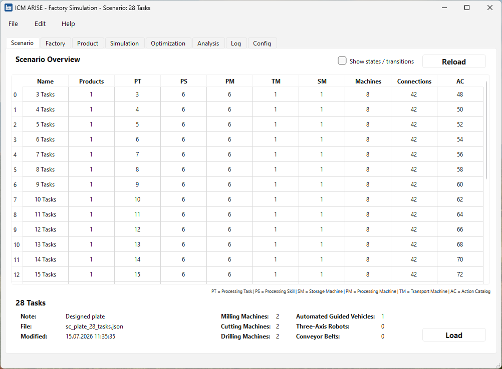
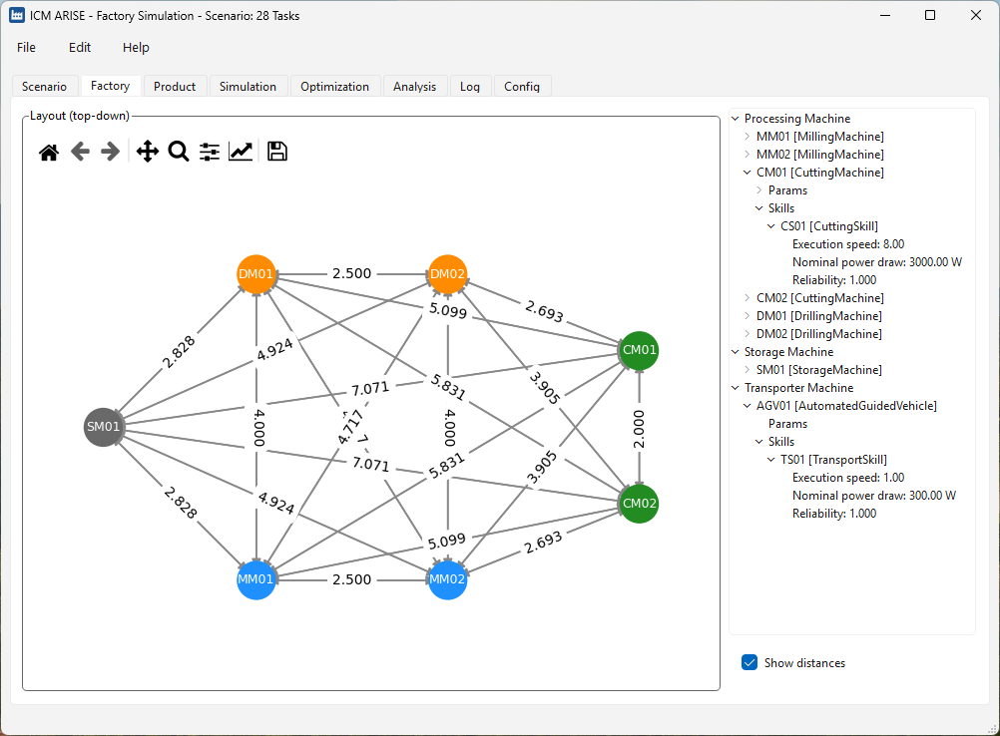
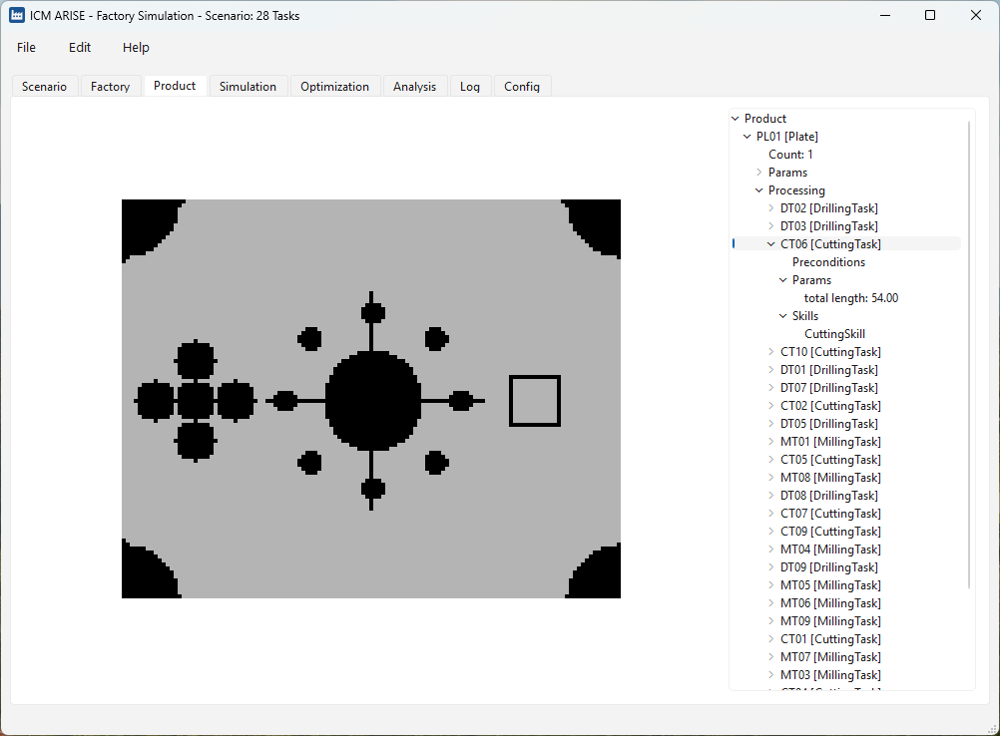
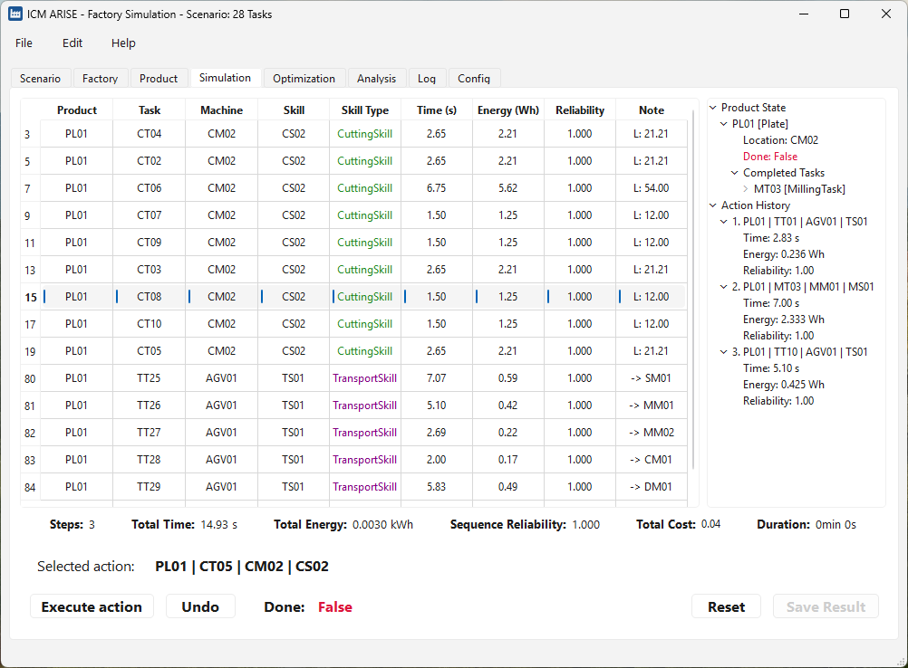
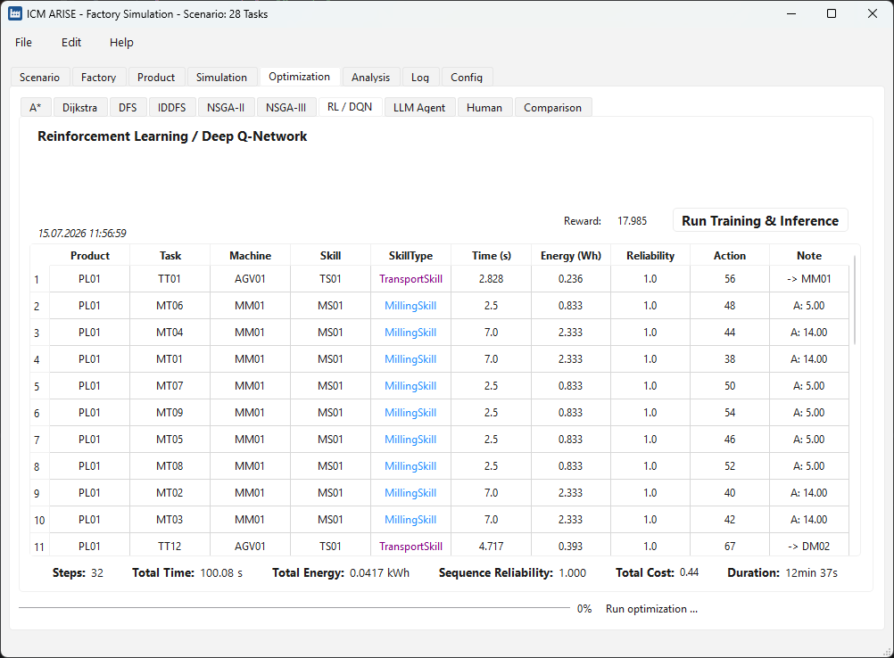
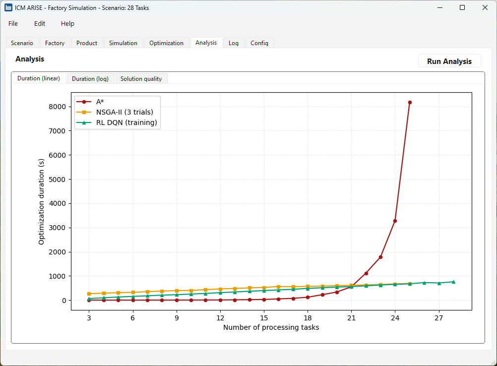

# ICM ARISE Project

**ARISE**: **A**daptive **R**isk-Aware **I**ntelligent **S**cheduling **E**ngine for Manufacturing

_"The main objective of the ARISE project is to establish a skill-based 
manufacturing approach that enables multi-criteria planning, built on a 
metamodel of high-level CPPS skills and advanced AI-enhanced planning algorithms."_ (Work Program ISW and IAS)

[ICM ARISE BUP61 - Project Overview](https://www.icm-bw.de/en/projects/project-overview/details/bup61-arise)

**Contributors:**  
Patrick Fischer & Andrey Morozov  
Institute of Industrial Automation and Software Engineering (IAS)  
University of Stuttgart, Germany

## Funding

This research has been funded by the Ministry of Science, Research and Arts of
the Federal State of Baden-Württemberg within the InnovationsCampus Future
Mobility: https://www.icm-bw.de/.

## Publications

This software has been used in the following publications:

1. M. Hossfeld, P. Fischer, A. Uhl, A. Wortmann, and A. Morozov,
   "Integrating risk into skill-based manufacturing: A modular platform for
   multi-objective optimization" in *Proceedings of the 36th European Safety
   and Reliability & the 34th Society for Risk Analysis Europe Conference*,
   Braga, Portugal, 2026.

2. P. Fischer, A. Morozov, A. Uhl, A. Wortmann, C. Ellwein, and  M. Hossfeld, "Comparative Evaluation of AI-Based and Classical Algorithms for Risk-Aware Multi-Objective Skill Sequencing in Manufacturing" in *Proceedings of the
   31st IEEE International Conference on Emerging Technologies and Factory
   Automation (ETFA)*, Västerås, Sweden, 2026. Accepted (in publication).

## Screenshots

The desktop application organizes the workflow into tabs, from scenario
inspection through interactive simulation to automated optimization and analysis.

### Scenario overview

Browse the benchmark scenarios and their key metrics, including the number of
processing tasks, processing skills, machine counts, connections, and
action-catalog size.



### Factory layout

Top-down graph of the factory: machines (storage, drilling, cutting, milling)
connected by transporters, annotated with inter-machine distances and per-skill
parameters (execution speed, nominal power draw, reliability).



### Product definition

The product to be manufactured (a plate) and its tree of processing tasks
(drilling, cutting, milling) with preconditions, geometric parameters, and the
skills required to complete each task.



### Interactive simulation

Step through the feasible actions manually, tracking the product state, action
history, and the cumulative time, energy, reliability, and cost of the schedule.



### Optimization

Run and inspect each scheduling method (A*, Dijkstra, DFS/IDDFS, NSGA-II/III,
reinforcement learning (DQN), and an LLM agent) on the same scenario under a
shared multi-objective cost model. The DQN result is shown here with its
per-step schedule and aggregate metrics.



### Analysis

Compare the methods across scenarios: optimization duration (linear and log
scale) and solution quality relative to the optimum, plotted over the number of
processing tasks.



## How to run it

The project runs directly from the repository root (there is no packaged
distribution). All internal imports assume the repository root is on the Python
path, so always run the commands below from the top-level project directory.

1. Create and activate a virtual environment (Python 3.14).

   Windows (PowerShell):

   ```powershell
   python -m venv .venv
   .\.venv\Scripts\Activate.ps1
   ```

   Linux / macOS:

   ```bash
   python -m venv .venv
   source .venv/bin/activate
   ```

2. Install the dependencies:

   ```
   pip install -r requirements.txt
   ```

3. Launch the graphical application:

   ```
   python -m src.arise_project.main_ui
   ```

To run the command-line entry point instead:

```
python -m src.arise_project.main
```

Run the tests with:

```
pytest
```

The LLM agent scheduler additionally requires API credentials in a
`src/arise_project/scheduler/llm/.env` file (not included in the repository).


### LICENSE INFORMATION

ICM ARISE Factory Simulation - A modular software platform that decouples simulation from scheduling and enables fair benchmarking of heterogeneous multi-objective optimization methods.
Copyright (C) 2026 Institute of Industrial Automation and Software Engineering, University of Stuttgart - Primary Author: Patrick Fischer

This program is free software: you can redistribute it and/or modify
it under the terms of the GNU General Public License as published by
the Free Software Foundation, either version 3 of the License, or
(at your option) any later version.

This program is distributed in the hope that it will be useful,
but WITHOUT ANY WARRANTY; without even the implied warranty of
MERCHANTABILITY or FITNESS FOR A PARTICULAR PURPOSE.  See the
GNU General Public License for more details.

You should have received a copy of the GNU General Public License
along with this program.  If not, see <https://www.gnu.org/licenses/>.
